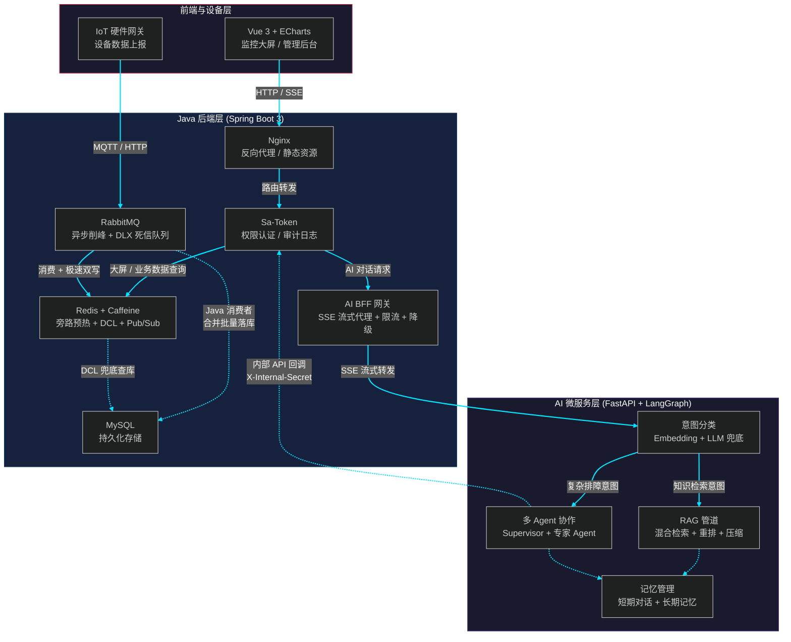

# 分布式数据中心智能监控与预警平台

## 项目简介

本项目是一个面向数据中心和工业物联网场景的**设备监控与智能排障平台**。Java 后端作为核心业务层，负责设备数据采集、高并发削峰、缓存防击穿、权限认证和审计日志等基础能力，同时通过 SSE 流式转发对接独立的 AI 微服务，为运维人员提供智能故障诊断和排障建议。

---

## 核心技术栈

* **核心框架：** Java 17 + Spring Boot 3.3.4
* **持久层：** MyBatis-Plus 3.5.5 + MySQL 8.0
* **权限认证：** Sa-Token 1.38 (轻量级 RBAC 鉴权)
* **缓存：** Redis + Redisson 3.27.0 (分布式锁) + Caffeine 3.1.8 (本地二级缓存)
* **消息队列：** RabbitMQ (Topic 交换机 + 手动 ACK)
* **AI 服务对接：** WebFlux SSE 流式代理 + 限流 + 熔断 + 降级
* **前端：** Vue 3 + Vite + Element Plus + ECharts
* **容器化：** Docker + Docker Compose (6 服务一键编排)

---

## 系统架构

---

## 技术亮点

### 1. RabbitMQ 异步削峰与高可靠投递
硬件网关并发上报数据时，利用 RabbitMQ 进行流量削峰，保护 MySQL 连接池：
* **异步解耦：** 上报数据直接打入 Topic 交换机，不占用 Web 容器线程，实现毫秒级响应。
* **重试与死信队列（DLX）：** 消费端采用手动 ACK。为防止异常导致的无限重试雪崩，配置了最大重试次数，超限后消息自动路由至死信队列，交由定时任务补偿处理，保障消息高可靠投递。
* **冷热分离双写：** 消费者极速写入 Redis 供 AI 微服务与前端大屏高频查询，同时异步落库 MySQL 进行持久化和告警规则判定。

### 2. 旁路预热 + Redisson DCL 双重防缓存击穿
针对监控大屏首页的极高频聚合查询场景，设计了多级防护策略：
* **定时预热：** 采用定时任务（Scheduled）每隔 5 秒将大屏聚合指标刷入 Redis，彻底消除常规高并发下的大量读库压力。
* **DCL 分布式锁兜底：** 在极端情况（如 Redis 宕机重启、缓存大面积失效）下，采用 Redisson 分布式锁 + DCL（双重检查锁定）机制。获取锁的线程去重建缓存，利用 Watchdog 自动续期防止业务超时锁释放，严格控制只有 1 个线程穿透到数据库，完美规避缓存击穿。

### 3. AI 服务代理网关：限流 + 熔断 + 降级

Java 后端作为前端和 AI 微服务之间的 BFF 层，不是简单地透传请求，而是加了三层防护：

* **滑动窗口限流：** 基于 Caffeine 缓存实现按用户维度的双层限流（秒级 3 次 + 分钟级 10 次），防止个别用户刷爆 AI 接口（见 `AiRateLimiter`）
* **三态熔断器：** CLOSED → OPEN → HALF_OPEN 状态机，连续 5 次失败后熔断 30 秒，之后放 2 个探测请求，成功则恢复，失败则继续熔断（见 `AiCircuitBreaker`）
* **自动降级：** AI 微服务不可用时，自动降级到本地 `FallbackRagServiceImpl`，返回引导性提示，前端展示降级模式标识（见 `AiController`）
* **会话归属校验：** 校验 `conversation_id` 的用户前缀，防止越权访问他人对话记录

### 4. 三级缓存架构与 Pub/Sub 分布式一致性保障
系统提示词（Prompt）支持动态热更新，基于 Redis + Caffeine + MySQL 构建三级缓存：
* **多级读取：** 优先读 L2 Caffeine (JVM级，耗时<1ms)，未命中读 L1 Redis，全未命中加锁回源 L3 MySQL 并回写缓存。
* **Pub/Sub 缓存广播刷新：** 解决分布式集群本地缓存脏数据难题。管理员更新提示词时，不仅更新 Redis 和 DB，还会向 Redis Channel 发布广播消息。集群各节点监听到消息后，主动失效本地 Caffeine 缓存，保障全局最终一致性。

### 5. 零侵入异步审计日志

用自定义 `@Log` 注解 + Spring AOP 实现操作日志自动记录，不侵入业务代码：

* **全异步落库：** 在 `LogAspect` 中用 `CompletableFuture.runAsync()` 异步写日志，主线程不等待
* **跨线程身份传递：** 在主线程提前从 Sa-Token 的 ThreadLocal 拿到用户身份，传给异步任务，解决异步线程拿不到登录信息的问题
* **异常脱敏：** `GlobalExceptionHandler` 拦截所有异常，500 错误向前端只返回"系统繁忙"，完整堆栈留在后端日志，不暴露服务器路径和 SQL 结构

### 6. 内部接口安全防护

AI 微服务回调 Java 后端的内部接口（设备状态查询、故障分析等）需要安全隔离：

* **密钥校验：** `InternalApiInterceptor` 校验请求头中的 `X-Internal-Secret`，防止外部直接访问 `/api/internal/**` 接口
* **AI 请求链路追踪：** BFF 层为每个 AI 请求注入 `X-Trace-Id`，便于全链路排查

---

## AI 微服务对接

本项目的智能排障能力由独立的 AI 微服务提供（基于 FastAPI + LangChain + LangGraph），Java 后端通过以下方式与之交互：

* **SSE 流式转发：** 前端请求 `/api/ai/ask`，Java 后端用 WebFlux WebClient 透传到 AI 微服务的 `/api/ai/ask`，流式返回 SSE 事件
* **内部 API 回调：** AI 微服务通过 `/api/internal/**` 接口回调 Java 后端，实时查询设备状态、告警记录、维修进度等业务数据
* **提示词回源：** AI 微服务启动时和运行时通过 HTTP 回调 Java 端获取最新的系统提示词

AI 微服务的详细技术文档见 [MonitorAI/README.md](https://github.com/WiloMyst/MonitorAI)。

---

## 压测数据

在单机部署环境下进行压测，核心指标如下：

- **高并发削峰：** 模拟 5000 个 IoT 终端并发上报温度数据，通过 RabbitMQ 缓冲后 MySQL 写入 QPS 稳定在 800+，无死锁和连接池耗尽现象，借助 DLX 保障了异常消息的妥善兜底。
- **大屏防击穿：** 1000 个并发线程同时请求大屏聚合接口，在“预热+DCL”机制下，仅 1 个线程穿透到数据库，其余 999 个线程均在 30ms 内从 Redis 获取到数据，接口平均响应耗时控制在 50ms 以内。